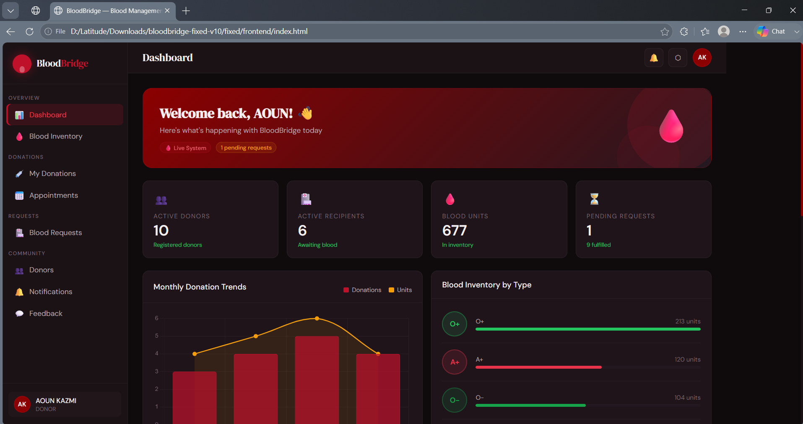
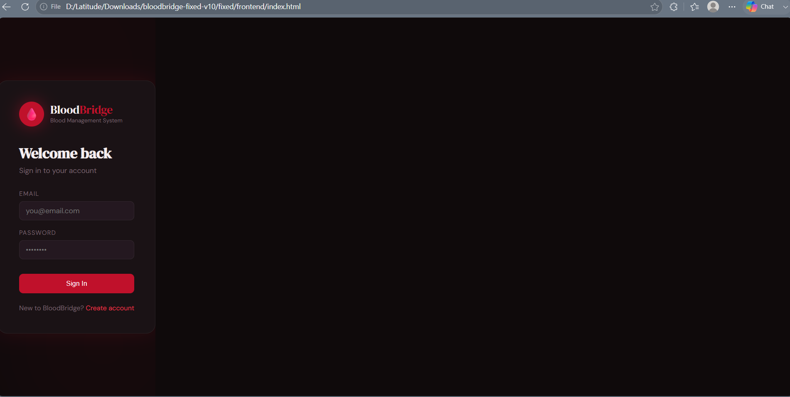
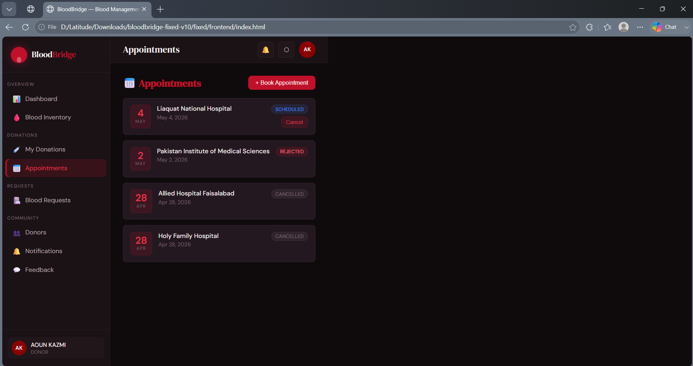
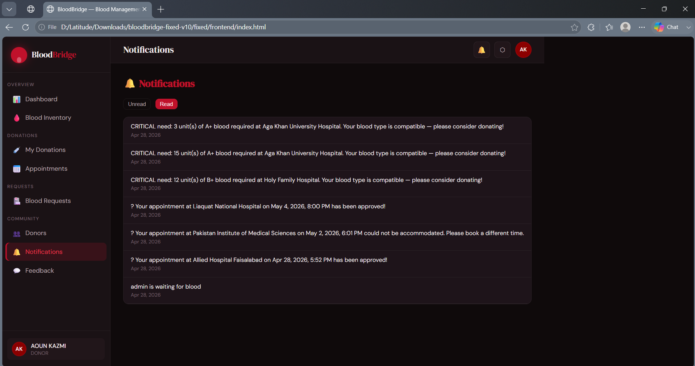
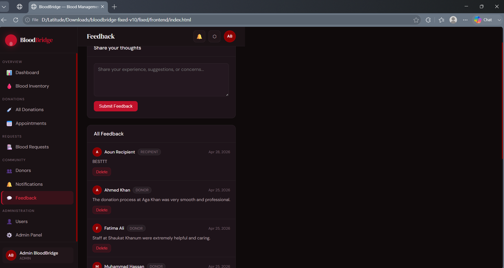
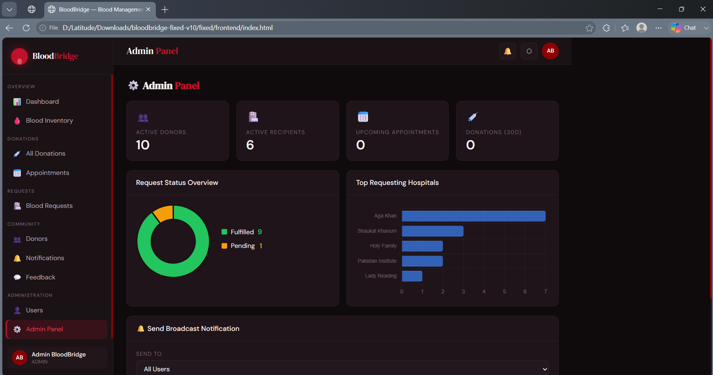

# 🩸 BloodBridge

A full-stack Blood Donation Management System that connects donors, recipients, and hospitals. Built using Node.js, Express, MSSQL, and a responsive frontend.

---

## 🚀 Features

### 👤 User Features

* User registration & login (JWT authentication)
* Donor profile management
* Blood donation requests
* Appointment scheduling
* Donation history tracking

### 🏥 System Features

* Blood bank inventory management
* Request approval/rejection system
* Notifications system
* Feedback system

### 🛠️ Admin Features

* Manage users and donors
* Handle blood requests
* Monitor blood inventory
* Admin-only protected routes

---

## 📸 Screenshots

### Home Page



### User Login



### User appointments



### Notifications



### Feedbacks



### Admin Portal



---

## 🧱 Tech Stack

### Frontend

* HTML
* CSS
* JavaScript

### Backend

* Node.js
* Express.js
* JWT Authentication

### Database

* Microsoft SQL Server (MSSQL)

---

## 📁 Project Structure

```text
bloodbridge/
├── backend/
│   ├── server.js
│   ├── config/
│   ├── middleware/
│   ├── routes/
│   ├── package.json
│   └── package-lock.json
├── frontend/
│   ├── index.html
│   ├── style.css
│   └── app.js
└── .gitignore
```

## ⚙️ Setup Instructions

### 1. Clone Repository

```bash
git clone https://github.com/aounkazmi-dev/bloodbridge.git
cd bloodbridge
```

### 2. Install Backend Dependencies

```bash
cd backend
npm install
```

### 3. Create Environment File

Create a `.env` file inside `backend/`:

```env
DB_HOST=your_database_host
DB_USER=your_database_user
DB_PASSWORD=your_database_password
DB_NAME=your_database_name
JWT_SECRET=your_secret_key
PORT=5000
```

### 4. Run Backend Server

```bash
node server.js
```

Server runs at:

```text
http://localhost:5000
```

### 5. Run Frontend

Open:

```text
frontend/index.html
```

---

## 👨‍💻 Author

**Aoun**

---

## 📄 License

This project is for educational purposes only.
